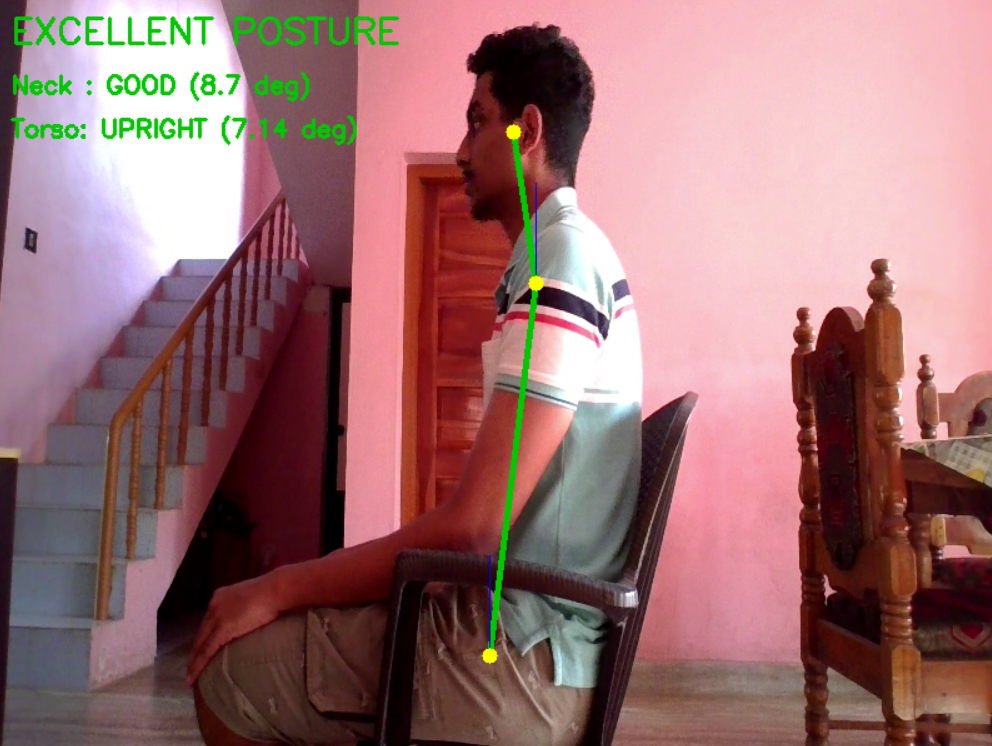
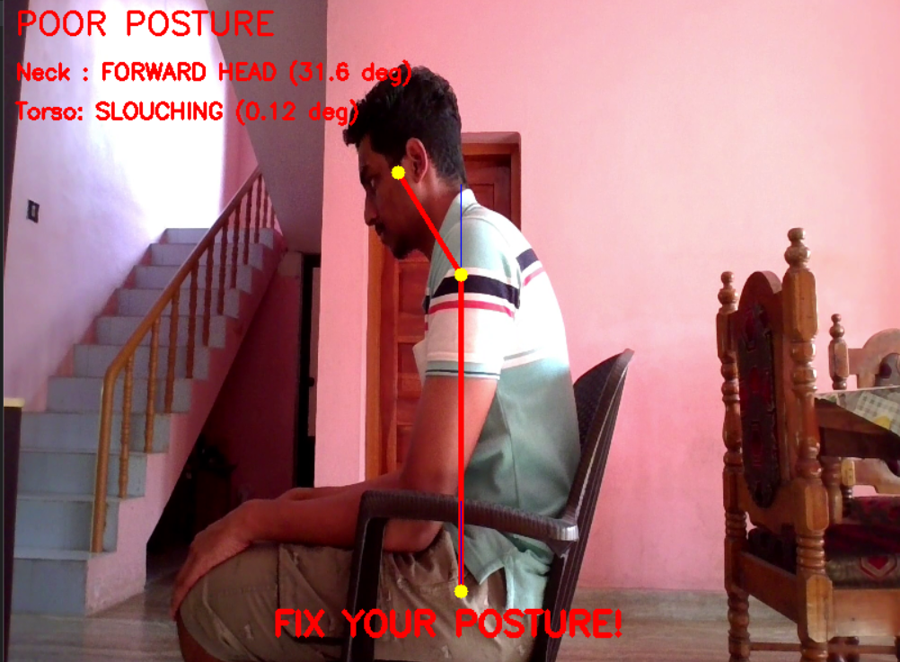

# Sitting Posture Monitoring System

A real-time **Sitting Posture Monitoring System** built using **Python, OpenCV, MediaPipe, and NumPy**. The application detects improper sitting posture by estimating human body landmarks and calculating **neck** and **torso angles** to identify **forward head posture** and **slouching**. It provides instant visual feedback to encourage healthy sitting habits.

---

## Features

- Real-time posture monitoring from a video file or webcam
- Automatic human pose estimation using MediaPipe Pose
- Detection of:
  - Forward Head Posture
  - Slouching
- Dynamic posture classification:
  - Excellent Posture
  - Fair Posture
  - Poor Posture
- Live visualization of:
  - Neck angle
  - Torso angle
  - Posture status
- Corrective alert when poor posture is detected
- Automatic selection of the dominant body side for improved robustness
- Warm-up calibration to stabilize posture estimation
- Hysteresis (state memory) to reduce false posture switching

---

## Technologies Used

- Python
- OpenCV
- MediaPipe Pose
- NumPy

---

## Installation

### Clone the repository

```bash
git clone https://github.com/yourusername/sitting-posture-monitoring.git

cd sitting-posture-monitoring
```

```bash
pip install opencv-python mediapipe numpy
```

---

## How It Works

1. Captures frames from a video or webcam.
2. Uses **MediaPipe Pose** to detect body landmarks.
3. Automatically selects the most visible body side.
4. Calculates:
   - Neck angle (Ear → Shoulder)
   - Torso angle (Shoulder → Hip)
5. Compares calculated angles against predefined thresholds.
6. Classifies posture as:
   - Excellent
   - Fair
   - Poor
7. Displays posture status, measured angles, and corrective feedback in real time.

---

## Posture Detection Logic

### Neck Posture

Forward head posture is detected by measuring the angle between:

- Vertical reference line
- Shoulder
- Ear

If the neck angle exceeds the predefined threshold, the posture is classified as:

```
Forward Head
```

Otherwise:

```
Good
```

---

### Torso Posture

The torso angle is measured between:

- Vertical reference line
- Hip
- Shoulder

Based on threshold values:

```
Small angle  → Slouching

Large angle  → Upright
```

State memory is used to prevent rapid posture fluctuations caused by minor body movements.

---

## Output

The application displays:

- Overall posture status
- Neck posture
- Torso posture
- Neck angle
- Torso angle
- Real-time skeleton visualization
- Corrective warning message when poor posture is detected





---

## License

This project is licensed under the MIT License.

```
MIT License

Copyright (c) 2026 Kasinath M S

Permission is hereby granted, free of charge, to any person obtaining a copy
of this software and associated documentation files to deal in the Software
without restriction, including without limitation the rights to use, copy,
modify, merge, publish, distribute, sublicense, and/or sell copies of the
Software.
```
